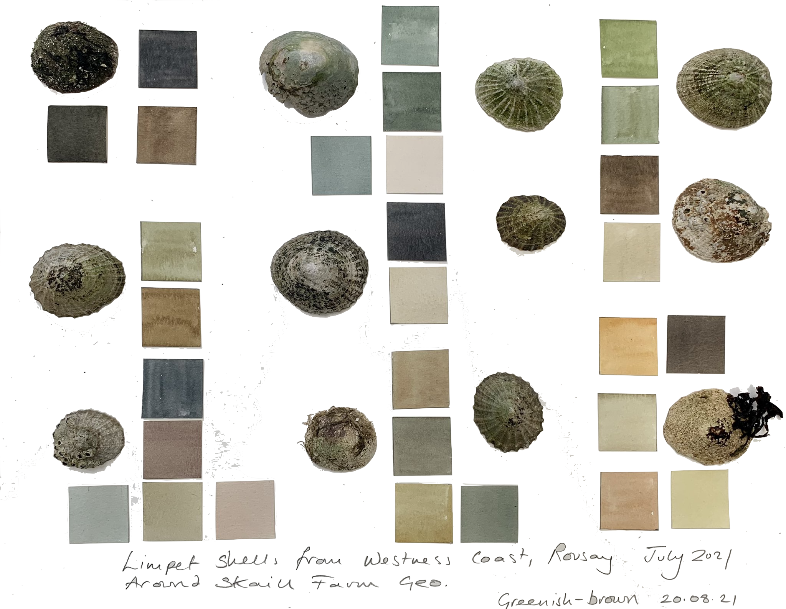

# Limpet_pal
Contains colour palettes based on limpet paintings by the Human Limpet Project ([Twitter](https://twitter.com/HelenChanges),[Facebook](https://m.facebook.com/limpetsthroughtime/)).

---

## Installation

You can load the package via `devtools::install_github("Niklas-palaeo/Limpet_pal")`.

It is used like this: 
`lim_palette("pal1",15,"continuous")` and can be integrated with the ggplot2 package:
`plot+scale_fill_manual(values=lim_palette("pal3"))`
